# DCS Assessment Command Center v2.0

A **database-backed, multi-user web application for planning, executing,
scoring, reviewing, and reporting Data-Centric Security (DCS) compliance
assessments** during operational events.

v2.0 keeps the entire v1 assessment workbench — 55 DCS compliance checks
across 10 domains, mission threads, protected data objects, test cards,
evidence, findings, reports, and cross-event program trends — and adds
**named user accounts, thirteen assessment-specific roles, formal review and
approval decisions, a cryptographically chained audit trail, and a
PostgreSQL-backed multi-user Docker deployment.**

> Core assessment question:
> **Did the event prove that protected data can be discovered, labeled,
> governed, accessed, denied, shared, monitored, and audited under Zero Trust
> conditions?**

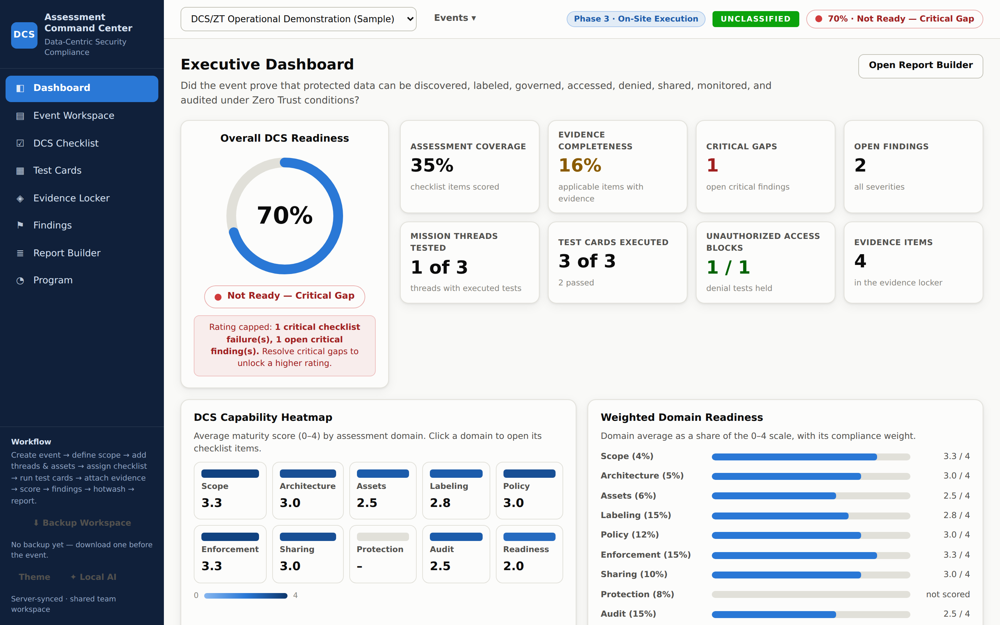

---

## What's new in v2.0

| Area | v1.0 (still downloadable) | v2.0 (this branch) |
|---|---|---|
| **Users** | Anonymous, single shared workspace | Named accounts, bcrypt password hashing, forced first-login password change, session revocation |
| **Access control** | None (anyone on the URL had full edit) | 3 system access levels × 13 assessment-specific roles, enforced server-side per-field |
| **Persistence** | Single JSON file on a Docker volume | PostgreSQL with a JSONB assessment state, revision counter, deletion soft-delete, and referential integrity |
| **Concurrency** | Revision-based conflict detection | Same, plus per-field permission checks; a stale save can never silently overwrite another user's work |
| **Attribution** | None | Every checklist item, test card, evidence record, finding, mission thread, asset, participant, system, and daily log tracks who created it, who last updated it, and when |
| **Audit** | None | Append-only, **cryptographically chained** audit log — each entry's hash links back to the previous entry, so tampering with history is detectable |
| **Approvals** | None | Formal Submit → Changes Requested / Approved / Reopened decisions with decision authors, comments, and timestamps |
| **Security posture** | Optional HTTP Basic Auth | Session cookies with CSRF tokens, HttpOnly + SameSite, login rate limiting, lockout after repeated failures, `helmet` HTTP hardening, non-root container, internal-only DB network |
| **Backup / restore** | JSON download from the UI | UI-driven **and** `scripts/backup.sh` / `scripts/restore.sh` calling `pg_dump` / `pg_restore` against the running database |
| **Test suite** | None | `node --test` covers RBAC and audit-chain invariants |

Everything from v1 still applies to v2: 55-item DCS checklist library, critical
gate, decision-log ingestion with false-allow detection, optional local AI
drafting, CSV imports, print-ready Report Builder, cross-event Program view.

---

## Table of contents

1. [At a glance](#at-a-glance)
2. [Screenshots](#screenshots)
3. [Quick start](#quick-start)
4. [User accounts and roles](#user-accounts-and-roles)
5. [User guide — running an assessment end to end](#user-guide--running-an-assessment-end-to-end)
6. [Approvals and formal review](#approvals-and-formal-review)
7. [Audit trail and attribution](#audit-trail-and-attribution)
8. [Module reference](#module-reference)
9. [Scoring engine and the critical gate](#scoring-engine-and-the-critical-gate)
10. [Running a program of assessments](#running-a-program-of-assessments)
11. [Docker deployment and configuration](#docker-deployment-and-configuration)
12. [Backup and restore](#backup-and-restore)
13. [Data model and integrations](#data-model-and-integrations)
14. [Optional local AI drafting](#optional-local-ai-drafting)
15. [Downloading v1.0](#downloading-v10)
16. [Roadmap](#roadmap)
17. [Standards references](#standards-references)
18. [Repository layout](#repository-layout)
19. [Development](#development)

---

## At a glance

| Capability | What it does |
|---|---|
| Full assessment lifecycle | Scope & Planning → Assessment Design → On-Site Execution → Analysis & Reporting, tracked as an explicit event **phase** |
| 55-item DCS compliance checklist | All white-paper items across 10 domains, each with an assessment question, expected evidence, severity-if-failed, and NIST 800-53 / DoD ZT / CISA / NSA standards mappings |
| Scenario test cards | Expected vs. actual DCS outcome, PDP/PEP results, latency, one-click "convert failure to finding" |
| Evidence Locker with chain of custody | Typed records with source, captured-by, timestamp, classification, quality grade, and file attachments |
| Decision-log ingestion | Import PDP/PEP/SIEM exports (CSV, JSON, NDJSON) with an audit reconstruction timeline and automatic false-allow / false-deny detection |
| Findings with full traceability | Mission Thread → Checklist Item → Test Card → Evidence → Finding, clickable at every step |
| Report Builder | Print-ready final assessment report (11 sections) plus CSV / JSON exports |
| Program view | Cross-event maturity trend, domain × event matrix with first→latest deltas, program-wide open critical gaps, reusable strength patterns |
| **Multi-user platform (new)** | Named user accounts, session cookies with CSRF, login throttling and lockout, forced first-login password change |
| **13 assessment roles + 3 system roles (new)** | Server-side permission checks per field; a role that isn't allowed to edit findings can't edit findings via any code path |
| **Attribution on every record (new)** | Who created it, who last touched it, and when — displayed in every drawer |
| **Cryptographically chained audit (new)** | Every state change is logged; each entry hash-links to the previous entry so history is tamper-evident |
| **Formal submit / approve / reopen (new)** | Assessment Leads submit for review; Independent Reviewers or Approving Officials record explicit decisions |
| Optional local AI drafting | Draft finding impact / recommendation and the executive narrative via a locally hosted model (Ollama) — draft-only guardrail |

---

## Screenshots

The assessment workbench UI is unchanged from v1 — the same 12 screens (which
are what most of the team spends time in) are documented here. v2 adds three
authenticated shell screens on top: **Sign In**, **Administration & Team**,
and **Activity & Approvals**.

Executive Dashboard — readiness gauge with the critical gate, weighted domain
heatmap, evidence-gap tracker, mission-thread readiness, and stat tiles that
drill through everywhere.


Event Workspace — event profile with the assessment phase selector, plus the
event readiness meter (planning inputs) that appears above every tab.

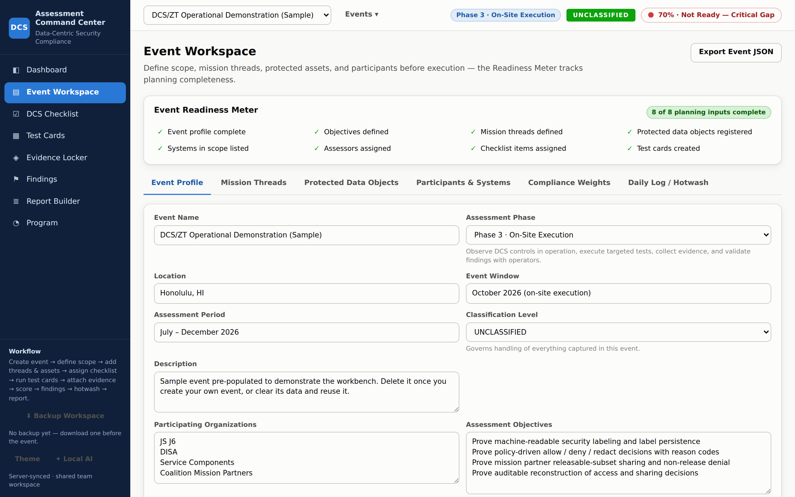

Mission threads tie every checklist item and test card to an operational
outcome.

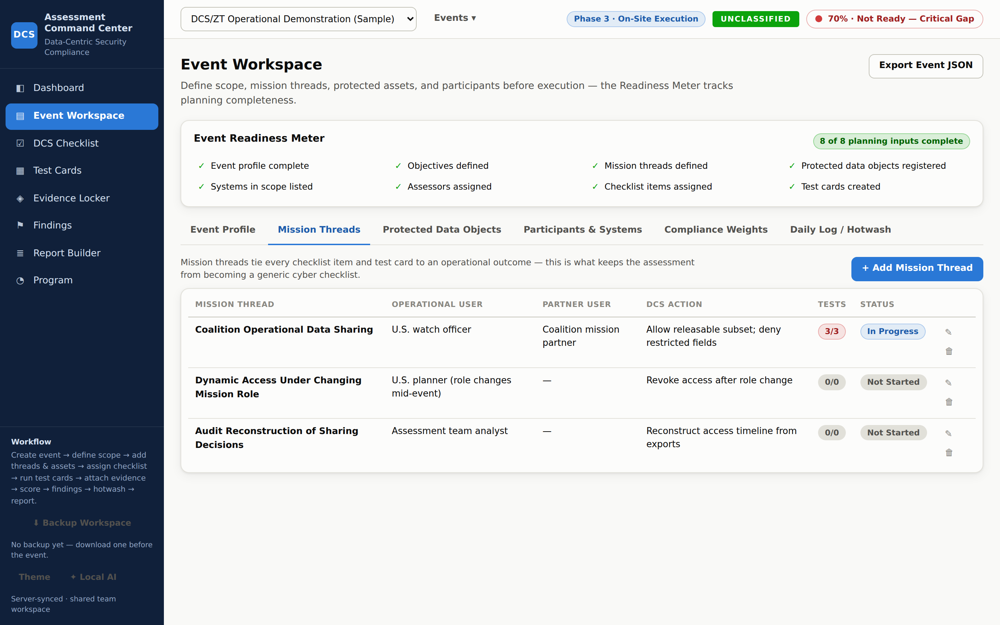

DCS Checklist — 55 items grouped by domain, filterable by domain, result,
workflow, severity, missing evidence, owner, and mission thread.

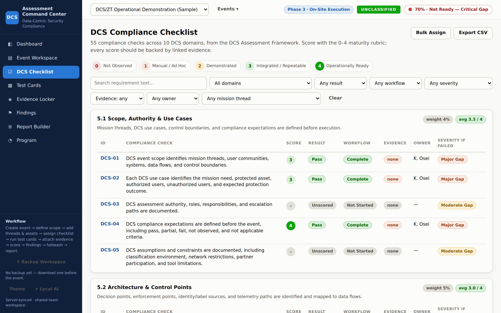

Drill into any item to see the requirement, assessment question, expected
evidence, standards mapping, and score / result / evidence links. In v2 the
drawer also shows **created by / last updated by / at**, and disables editing
controls when the signed-in user's role doesn't permit that edit.

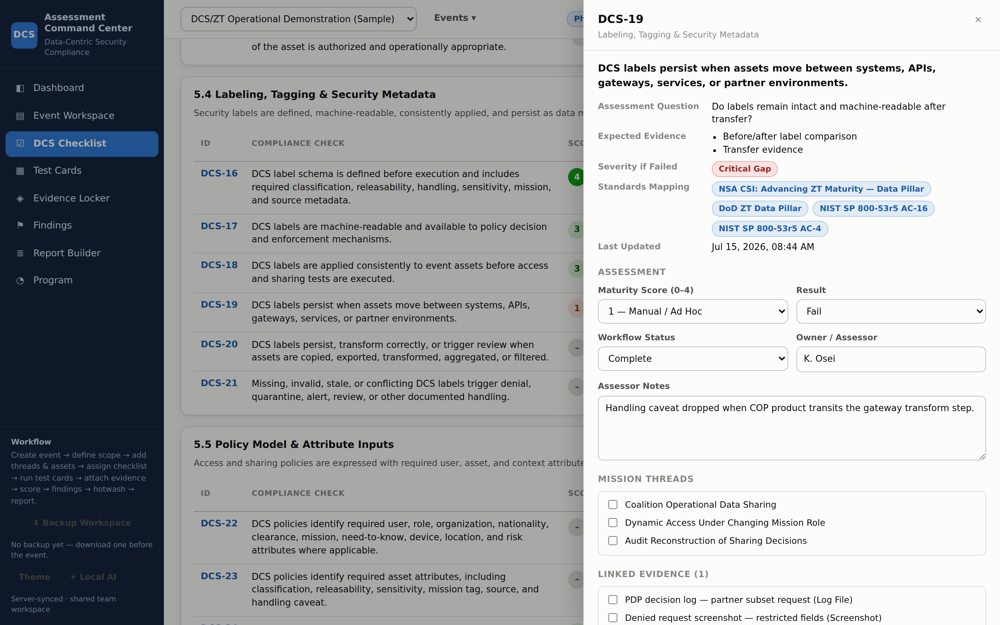

Test Cards — expected vs. actual DCS outcome, PDP / PEP results, latency,
hotwash notes, and one-click conversion of failures into findings.

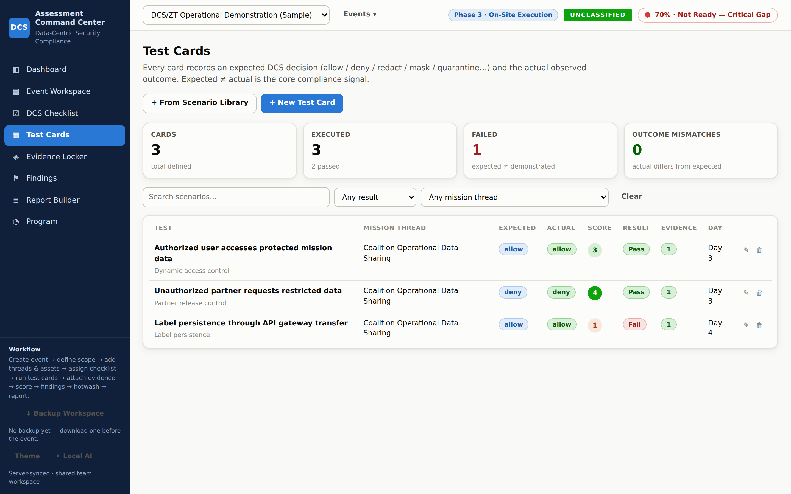

Evidence Locker — typed evidence with chain-of-custody metadata, quality grade,
optional file attachments, and decision-log ingestion with the audit
reconstruction timeline.

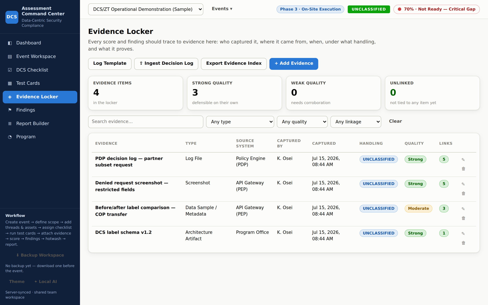

Findings — severity, remediation status, and clickable end-to-end
traceability.

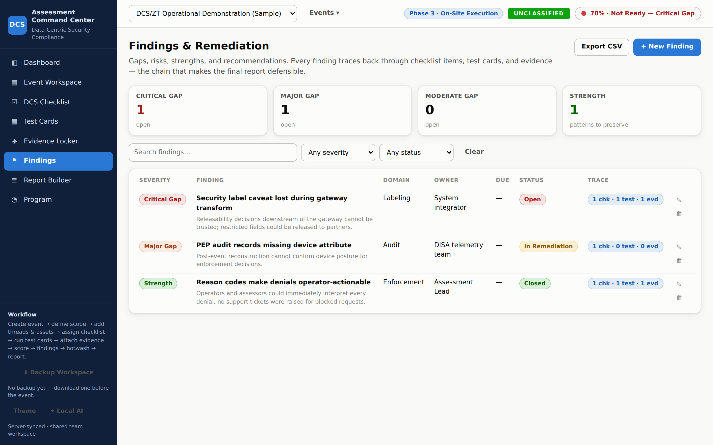

Every finding's traceability chain: Mission Thread → Checklist Item → Test Card
→ Evidence.

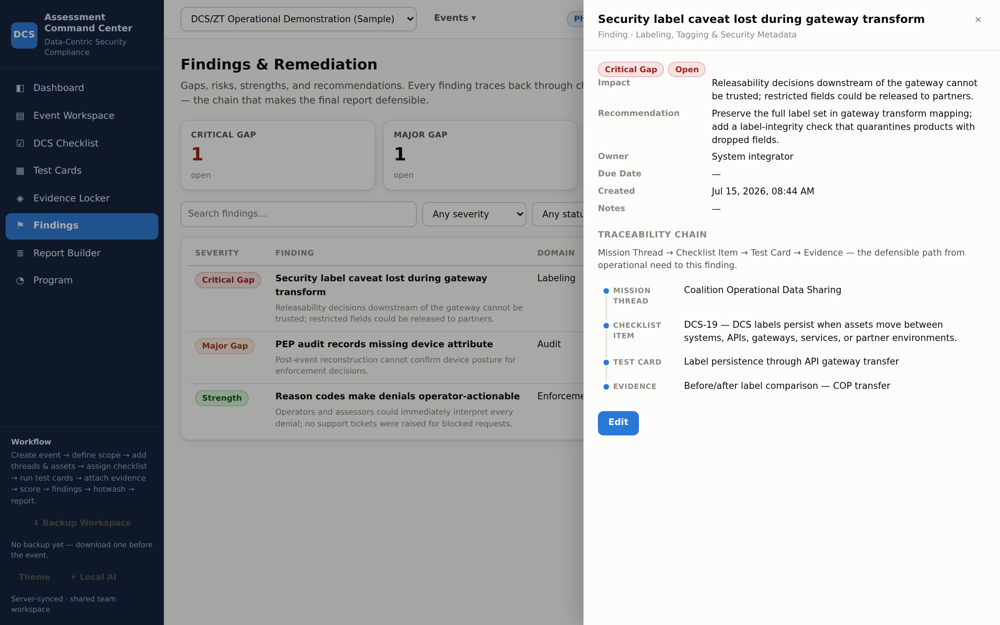

Report Builder — print-ready final report with selectable sections; export CSV
or JSON for the appendix package.

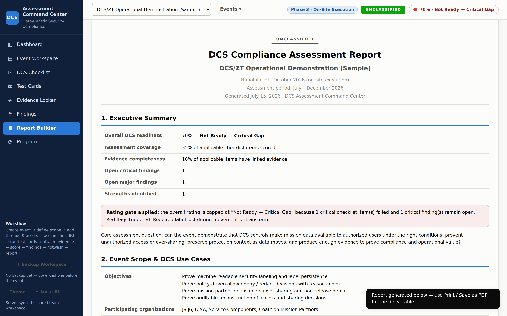

Program view — cross-event picture for an assessment series: readiness trend,
domain × event maturity with first→latest deltas, and the reusable-strengths
library.

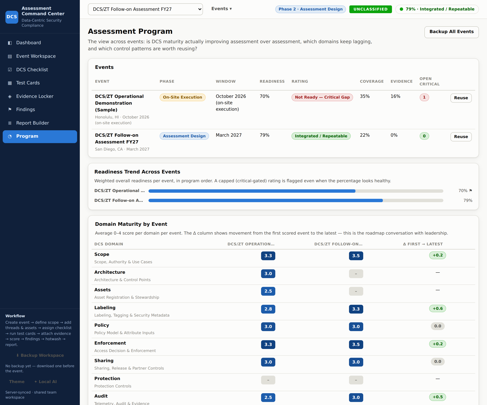

Getting Started card — appears on the dashboard of a fresh event and
disappears on its own once planning is complete and scoring begins.

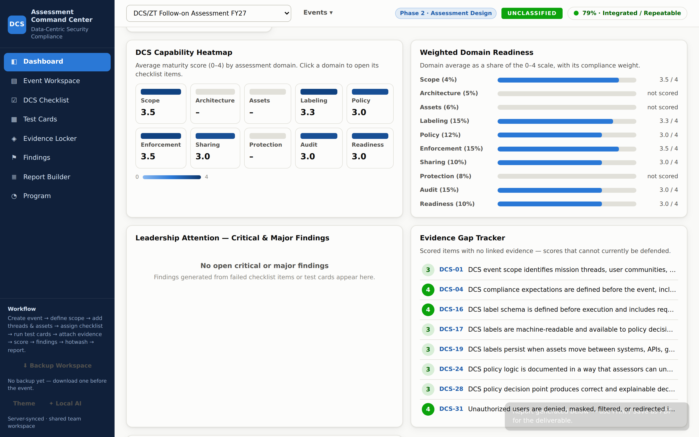

---

## Quick start

v2.0 is a Postgres-backed multi-user application. Docker Compose brings both
the app container and the database up together.

### 1. Prepare your environment

```bash
cp .env.example .env
# open .env and set unique values for at minimum:
#   POSTGRES_PASSWORD
#   ADMIN_USERNAME
#   ADMIN_PASSWORD
```

### 2. Bring the stack up

```bash
docker compose up -d
# → http://<host>:8080
```

### 3. Sign in as the bootstrap admin

- Username: whatever you set in `ADMIN_USERNAME`
- Password: whatever you set in `ADMIN_PASSWORD`

**The UI forces a password change on first sign-in.** Change the password,
then go to *Administration & Team* to create the rest of the users and assign
their system roles. Assessment-specific roles are assigned per assessment once
you create one (or invite users into the seeded sample assessment).

### 4. (Optional) seed the sample assessment

`SEED_SAMPLE_DATA=true` in `.env` (the default) auto-creates the DCS/ZT
Operational Demonstration sample assessment on first boot so every screen has
data. Set to `false` for a clean production deployment.

---

## User accounts and roles

Access is enforced at two layers: the **system role** on the user record, and
the **assessment role** granted per assessment. Effective permissions are the
union of the two.

### System roles

| Role | Purpose |
|---|---|
| **System Administrator** | Full platform authority: manages user accounts, system roles, backups, and the audit trail. Not intended to score assessment items directly. |
| **Program Manager** | Owns the program of assessments: can create new assessments and view reports across the portfolio. Assessment-level rights are still granted by the assessment role. |
| **Standard User** | Base account. Sees only the assessments they are staffed on, with rights determined entirely by their assessment role. |

### Assessment roles (13)

Assigned per assessment in *Administration & Team → Assessment Team*.

| Role | Responsibility |
|---|---|
| **Assessment Program Manager** | Owns the program's event portfolio, staffing, approvals, and delivery |
| **Assessment Lead** | Leads one assessment from scope through final report and manages the assessment team |
| **Lead Assessor** | Coordinates assessors, scoring, evidence sufficiency, findings, and report development |
| **DCS Control Assessor** | Executes DCS checklist checks, test cards, evidence capture, scoring, and drafts findings |
| **Security / Zero Trust Assessor** | Assesses policy decision, enforcement, identity, device, network, and monitoring behavior |
| **Test Director** | Plans and controls test execution, expected outcomes, instrumentation, and hotwash records |
| **Evidence Custodian** | Maintains evidence intake, provenance, quality, classification, and chain of custody |
| **Data Steward / Data Product Owner** | Defines protected data objects, metadata, labels, sharing rules, and supporting evidence |
| **Technical SME / System Integrator** | Provides system context, supports tests, submits evidence, and responds to findings |
| **Mission Owner / Operational Representative** | Defines mission threads, validates mission impact, and reviews results |
| **Event Coordinator / Site Lead** | Maintains event logistics, participants, systems, schedules, and daily activity records |
| **Independent Reviewer / Approving Official** | Reviews evidence and findings, records approval decisions, and views the audit trail |
| **Observer / Read Only** | Can view assigned assessments and reports without changing records |

### Permission model

Roles resolve to a set of **permission tokens** enforced server-side. The
important ones:

| Permission | Grants |
|---|---|
| `assessment.view` | Read the assessment state |
| `assessment.create` | Create new assessments |
| `assessment.delete` | Delete assessments |
| `assessment.plan.edit` | Edit scope: profile, phase, threads, assets, participants, systems, weights, daily logs |
| `assessment.team.manage` | Add / remove team members and change their assessment roles |
| `checklist.manage` | Score checklist items and change their results / workflow |
| `test.manage` | Create, edit, and record outcomes for test cards |
| `evidence.manage` | Add, edit, or delete evidence records (including decision-log ingests) |
| `findings.manage` | Create, edit, or delete findings |
| `reports.view` | View report output |
| `reports.edit` | Edit the executive narrative and report configuration |
| `assessment.review` | Record a Changes-Requested review decision |
| `assessment.approve` | Approve or Reopen the assessment |
| `audit.view` | View the tamper-evident audit trail |
| `users.manage` | Create and manage user accounts (system admin only) |

The server maps **JSON paths inside the assessment state → permission tokens**
so, for example, editing anything under `state.findings` requires
`findings.manage` no matter which UI path the request came from. Attempts to
edit a field without the required permission are rejected with `403` before
the state ever changes; the audit chain records the denied attempt.

---

## User guide — running an assessment end to end

The app is organized around the assessment phases from the DCS Framework white
paper. The **assessment phase** on each event (top-bar chip, editable in
Event Workspace → Event Profile) tells the team where the event stands.

### Phase 1 — Scope & Planning

**Goal:** define what will be assessed and what "success" looks like before
anyone touches a control.

1. **Create the event** — *Events ▾ → + New Event* (requires `assessment.create`).
2. **Staff the team** — *Administration & Team → Assessment Team* (requires
   `assessment.team.manage`). Assign an Assessment Lead, a Lead Assessor, DCS
   Control Assessors, an Evidence Custodian, a Test Director, and Mission
   Owners at minimum.
3. **Event Profile** — record objectives, participating organizations,
   assessment period, and standards alignment. Set **Assessment Phase** to
   *Scope & Planning*.
4. **Mission Threads** — add each operational scenario the DCS capability must
   support. Every checklist item and test card gets tied back to one of these.
5. **Protected Data Objects** — register the datasets, APIs, feeds, files, and
   data products that the assessment will exercise. Use *CSV Template →
   Import CSV* for bulk loading.
6. **Participants & Systems** — record the systems in scope (PDPs, PEPs,
   gateways, data platforms, telemetry). Participants also accept CSV import.
7. **Compliance Weights** — accept the defaults or adjust.

**Check:** the **Event Readiness Meter** tracks 8 planning inputs. The
Dashboard shows a **Getting Started** card until planning is complete.

### Phase 2 — Assessment Design

1. **Assign checklist items** — Checklist → *Bulk Assign* to distribute
   domains across assessors (requires `assessment.plan.edit`).
2. **Link checklist items to mission threads** — inside each item's drawer.
3. **Build test cards** — *+ From Scenario Library* pulls proven patterns;
   each library card arrives pre-linked to the checklist items it proves.
4. **Move the phase to *Assessment Design***.

### Phase 3 — On-Site Execution

1. **Ingest decision logs** — Evidence Locker → *⇪ Ingest Decision Log* pulls
   PDP/PEP/SIEM exports directly into evidence, with false allows flagged
   loudly.
2. **Run test cards** — record the actual outcome, PDP / PEP results, latency,
   and hotwash notes. If a test fails, use *Convert Failure to Finding*.
3. **Score checklist items** — set the 0–4 maturity score and attach the
   evidence that supports it. **The Evidence Gap Tracker flags scored items
   with no evidence** — those scores cannot be defended.
4. **Daily rollups / hotwash** — Event Workspace → Daily Log captures
   Issues → Decisions → Actions.
5. **Watch the critical gate** — the readiness chip turns red the moment a
   critical item fails or a critical finding is open.

### Phase 4 — Analysis & Reporting

1. **Findings** — for each gap, write impact and recommendation, assign an
   owner and due date, set remediation status.
2. **Executive Narrative** — Report Builder → the Executive Narrative sits at
   the top of the report's Executive Summary. Optionally use *Draft from
   current scores & findings* (local AI).
3. **Submit for Review** — Activity & Approvals → *Record Review Decision →
   Submit*. Reviewers respond with *Changes Requested* or *Approved*.
4. **Generate the report** — select sections, then *Generate Report* → *Print
   / Save as PDF*. Add the Checklist CSV, Findings CSV, Evidence Index CSV,
   and Full Event JSON to the appendix package.
5. **Move the phase to *Complete / Archived***. The event stays in the
   Program view for cross-event comparison.

---

## Approvals and formal review

v2 formalizes review so the report is defensible.

- **Submit for Review** — the Assessment Lead posts a decision that ends the
  active editing phase. Recorded with author, timestamp, and comments.
- **Changes Requested** — a reviewer with `assessment.review` documents what
  must change. Editing reopens automatically for the assigned roles.
- **Approved** — an approver with `assessment.approve` closes the review. The
  approval is stamped into the audit chain.
- **Reopen** — an approver can reopen an approved assessment; the reopen event
  is stamped too, so you never lose the record of what was "approved as of
  X, reopened by Y for reason Z."

Decisions are visible on the *Activity & Approvals* screen and appear in the
generated report's appendix as the review chronology.

---

## Audit trail and attribution

Every state change goes through the server, which:

1. Diffs the incoming state against the last saved state and records the set
   of changed JSON paths (see `src/audit.js → changedPaths`).
2. Attributes each change to the authenticated user and their session IP /
   user agent.
3. Appends the entry to an **append-only log with a cryptographic hash
   chain**: each entry hashes over `{ previous_hash, timestamp, author, paths,
   payload_hash }`, so if any historical entry is altered the chain breaks.
4. Every displayed record (checklist item, evidence, finding, thread, asset,
   participant, system, daily log) surfaces a `Created by … · Updated by …`
   line so ownership is never ambiguous.

Users with `audit.view` see the full chronological log on the *Activity &
Approvals* screen (assessment-scoped, most recent first, filterable). Users
without `audit.view` still see the review chronology and any attribution shown
inline.

---

## Module reference

| Module | Notes |
|---|---|
| **Sign In** | Bcrypt password check, session cookie (HttpOnly, SameSite), CSRF token issuance, rate-limited to defeat brute force, forced password change on first sign-in |
| **Dashboard** | Readiness gauge with critical-gate note, weighted domain heatmap, domain readiness bars, stat tiles, evidence gap tracker, mission-thread readiness, Getting Started card for fresh events |
| **Event Workspace** | Profile, readiness meter, mission threads, protected data objects, participants & systems (with CSV import), compliance weights, daily log |
| **DCS Checklist** | 55 items grouped by domain, filters, bulk assign, drill-in drawer with attribution, score / notes / thread links / evidence links / finding generation, CSV export |
| **Test Cards** | Scenario library, stats, filterable list, drill-in drawer with PDP/PEP + latency + hotwash notes, *Convert Failure to Finding* |
| **Evidence Locker** | Typed records with quality grade, optional file attachment, decision-log ingestion with audit reconstruction timeline, evidence index export |
| **Findings** | Severity, remediation status, owner, due date, traceability chain, CSV export |
| **Report Builder** | 11 selectable sections; assessor-owned Executive Narrative (optional AI-drafted); print-ready output; CSV / JSON exports |
| **Program** | Cross-event: events table with phase / readiness / rating / coverage / evidence / open criticals; readiness trend; domain × event maturity matrix; reusable-strengths library; program-wide open critical gaps; one-click *Reuse* to start the next event from any prior event's setup |
| **Activity & Approvals** *(new)* | Review chronology, audit trail (for `audit.view`), *Record Review Decision* action for reviewers and approvers |
| **Administration & Team** *(new)* | User directory, create / disable accounts, set system roles, assign assessment team members and roles |

### Scoring rubric (0–4 maturity)

| Score | Meaning |
|---|---|
| 0 — Not Observed | No evidence collected or capability not demonstrated |
| 1 — Manual / Ad Hoc | Outcome exists only through manual, informal, or inconsistent activity |
| 2 — Demonstrated | Outcome worked in a controlled event scenario |
| 3 — Integrated / Repeatable | Outcome worked across systems with repeatable process and evidence |
| 4 — Operationally Ready | Outcome worked under realistic mission conditions with audit trail and measurable value |

### DCS domains (default compliance weights)

| Code | Domain | Weight |
|---|---|---:|
| 5.1 | Scope, Authority & Use Cases | 4 % |
| 5.2 | Architecture & Control Points | 5 % |
| 5.3 | Asset Registration & Stewardship | 6 % |
| 5.4 | Labeling, Tagging & Security Metadata | **15 %** |
| 5.5 | Policy Model & Attribute Inputs | 12 % |
| 5.6 | Access Decision & Enforcement | **15 %** |
| 5.7 | Sharing, Release & Partner Controls | 10 % |
| 5.8 | Protection Controls | 8 % |
| 5.9 | Telemetry, Audit & Evidence | **15 %** |
| 5.10 | Operational Readiness & Scale | 10 % |

Weights are editable per event (Event Workspace → Compliance Weights).

### Findings severity model

| Severity | Definition |
|---|---|
| **Critical Gap** | Unauthorized access, release of non-releasable data, policy bypass, missing audit trail for sensitive access, label loss causing release risk, or enforcement failure that defaults open |
| **Major Gap** | Capability works only manually, inconsistently, or outside the operational workflow; policy is not explainable; evidence is incomplete for key tests |
| **Moderate Gap** | Capability works but lacks automation, scale, repeatability, resilience, or complete telemetry |
| **Observation** | Improvement, integration issue, usability concern, or future planning item that does not block the event objective |
| **Strength** | Capability, control pattern, evidence model, or operational workflow that should be preserved, reused, or scaled |

---

## Scoring engine and the critical gate

The overall readiness percentage is a **weighted blend of the domain averages**
(domain % = mean of scored items ÷ 4, blended by the compliance weights over
domains that have at least one scored item).

The overall **rating** applies the critical gate on top of the percentage:

| Overall % | Rating (when no critical gate is tripped) |
|---:|---|
| ≥ 85 % | Operationally Ready |
| 62.5–85 % | Integrated / Repeatable |
| 40–62.5 % | Demonstrated |
| < 40 % | Manual / Ad Hoc |

**The critical gate — no misleading green.** Regardless of the percentage, the
overall rating is capped at *"Not Ready — Critical Gap"* when any of these are
true:

- a checklist item marked *severity: critical* has a **Fail** result, or
- any Critical severity finding is in **Open / In Remediation / Risk Accepted** status.

The dashboard's readiness gauge card explains exactly which items or findings
tripped the gate and links directly to them. A demonstrated false allow or
lost label matters more than a healthy-looking average.

---

## Running a program of assessments

- Every event carries an **assessment phase**, shown as a chip in the top bar.
- **Reuse as Template** (Events ▾ or the Program view) clones an existing
  event's scope, threads, assets, weights, assignments, and test cards with
  all scores / evidence / findings cleared — ready for the next event.
- The **Program view** compares events over time: is maturity improving,
  which domains keep lagging, which critical gaps are still open anywhere in
  the program, and which strength patterns should be reused.
- **Assessment JSON export / import** moves individual events between
  machines or archives them (attribution is preserved).
- **Database backups** move the entire program (see below).

---

## Docker deployment and configuration

### Services

`docker-compose.yml` defines two services:

- **`db`** — `postgres:16-alpine`. Exposed only inside the compose network
  (no host port published). Data persists in the `dcs-db` named volume.
- **`app`** — the Node application. Listens on `${APP_PORT:-8080}`. Runs as
  the non-root `node` user, uses `dumb-init`, and exposes a healthcheck
  against `/health`.

Traffic:

```
 browser ⇢ ${APP_PORT} (host)
              ↓
           app container ── internal DB network ──▶ db container
```

The database is never exposed to the host. To use an external Postgres
instead, remove the `db` service from compose and point `DATABASE_URL` (or
the individual `POSTGRES_*` variables) at your instance.

### Environment variables

| Variable | Default | Purpose |
|---|---|---|
| `APP_PORT` | `8080` | Host port to publish |
| `POSTGRES_DB` / `POSTGRES_USER` / `POSTGRES_PASSWORD` | `dcs` / `dcs` / *(required)* | Database credentials |
| `ADMIN_USERNAME` / `ADMIN_PASSWORD` / `ADMIN_DISPLAY_NAME` | *(required)* / *(required)* / *(defaulted)* | Bootstrap admin account (forced to change password on first login) |
| `SECURE_COOKIES` | `false` | Set `true` when the app is served over HTTPS |
| `TRUST_PROXY` | `0` | Set `1` when behind one trusted reverse proxy so client IP is captured correctly in the audit log |
| `SESSION_HOURS` | `12` | Session lifetime |
| `MAX_BODY_MB` | `32` | Upload cap; evidence attachments arrive as base64 |
| `SEED_SAMPLE_DATA` | `true` | Auto-create the sample assessment on first boot |

Any variable is settable in `.env` (which docker-compose reads) or exported in
your shell.

### Container hygiene

- Base image: `node:22-alpine`; the only runtime dependencies (`express`,
  `pg`, `bcryptjs`, `cookie-parser`, `compression`, `express-rate-limit`,
  `helmet`) are locked in `package-lock.json`.
- Runs as a non-root user.
- HTTP hardening via `helmet`, CSRF token validation on state-changing
  requests, session cookies HttpOnly + SameSite, login rate limiting.
- Body size cap at `MAX_BODY_MB`.
- Path traversal blocked; unknown API paths return `404`.
- Graceful shutdown on `SIGTERM` / `SIGINT` drains connections and closes the
  database pool before exit.
- Healthcheck: `GET /health` every 30 s.

---

## Backup and restore

Everything the platform holds — user accounts, sessions, assessments, audit
chain — lives in Postgres. Two ready-made scripts:

```bash
# Point-in-time backup while the stack is up
./scripts/backup.sh            # writes ./backups/dcs-<timestamp>.dump

# Restore from a dump (destructive; will confirm)
./scripts/restore.sh ./backups/dcs-2027-03-15T09-00-00Z.dump
```

Under the hood both call `pg_dump` / `pg_restore` inside the `db` container,
so nothing needs to be installed on the host.

Individual assessments can also be exported / imported as JSON via the UI
(*Report Builder → Full Event JSON*, or *Events ▾ → Import JSON*) for
transfer between deployments; attribution and audit history are preserved on
export and re-applied on import.

---

## Data model and integrations

### Postgres schema (key tables)

| Table | Contents |
|---|---|
| `users` | Named accounts, `password_hash`, system role, disabled flag, failed-login counter, lockout time, forced password change flag |
| `roles` | Assessment role catalog with `permissions` (JSONB) |
| `assessments` | One row per event with `state` (JSONB — the full workbench state), `revision` counter, `phase`, soft-delete columns, created/updated attribution |
| `assessment_members` | Team membership: `(assessment_id, user_id) → role_id`, with attribution and timestamp |
| `sessions` | Server-side session state: token hash, CSRF token, IP, user agent, expiry |
| `audit_events` | Append-only audit log with hash chaining |
| `reviews` | Formal Submit / Changes-Requested / Approve / Reopen decisions |
| `app_meta` | Bootstrap / migration flags |

### Bulk loading (CSV)

Event Workspace → *Participants* and → *Protected Data Objects* each have
*CSV Template* + *Import CSV* buttons. Rows missing a `name` are skipped and
reported.

### Decision-log ingestion

Evidence Locker → **⇪ Ingest Decision Log** imports a PDP / PEP / SIEM export
as a Decision Record evidence item.

- **Formats:** CSV, JSON array, `{records: [...]}`, or NDJSON.
- **Column aliases** normalize exports from different tools into the
  assessment schema (`@timestamp` / `principal` / `resource` / `outcome` →
  `timestamp` / `user` / `asset` / `decision`).
- **Auto-summary** on ingest: allows, denies, redact/mask/filter outcomes,
  distinct users and assets, average decision latency, time window.
- **Expected-vs-actual detection.** When the export carries an expected
  column, mismatches are counted and **possible false allows are flagged
  loudly**, pointing at DCS-31 — the white paper's immediate-escalation red
  flag.
- **Audit Reconstruction timeline** in the evidence drawer: filterable
  chronological table with mismatch highlighting.
- Ingests capped at 3,000 records per file.

### HTTP API

The frontend uses this API; automation can too.

| Method | Path | Purpose |
|---|---|---|
| `GET` | `/health` | Liveness probe |
| `POST` | `/api/auth/login` | Sign in; returns a session cookie and CSRF token |
| `POST` | `/api/auth/logout` | Revoke the current session |
| `POST` | `/api/auth/password` | Change password (used for the forced first-login change) |
| `GET` | `/api/session` | Current user, roles, permission map |
| `GET` | `/api/assessments` | List assessments the caller can see |
| `POST` | `/api/assessments` | Create assessment (`assessment.create`) |
| `GET` | `/api/assessments/:id` | Full assessment `{ revision, state, members }` |
| `PUT` | `/api/assessments/:id` | Save with `{ revision, state }`; per-field permission checks; `409` on stale revision, `403` on disallowed fields |
| `POST` | `/api/assessments/:id/reviews` | Record a review decision |
| `GET` | `/api/assessments/:id/reviews` | Review chronology |
| `GET` | `/api/audit?assessmentId=…&limit=…` | Audit trail (`audit.view`) |
| `GET` | `/api/roles` | Assessment role catalog |
| `GET` / `POST` / `PATCH` | `/api/admin/users` | User management (`users.manage`) |

CSRF: state-changing requests must include the `X-CSRF-Token` header returned
by `/api/session`. The client library in `js/auth.js` handles this
transparently.

---

## Optional local AI drafting

**✦ Local AI** (sidebar) connects the app to a model running on the same
machine via [Ollama](https://ollama.com). Nothing is sent to any cloud service.

When enabled:

- **Draft finding impact & recommendation** in the finding editor, grounded
  in the linked checklist requirements, expected-vs-actual test outcomes,
  evidence, and notes.
- **Draft the executive narrative** in the Report Builder, grounded strictly
  in the event's recorded scores and findings.

**Guardrail by design:** the assistant only writes into editable draft fields.
It never scores items, never changes results, never certifies compliance.
Every insert shows a *"review and edit before saving"* reminder.

**Setup:** install Ollama, `ollama pull llama3.1`, then Sidebar → **✦ Local
AI** → *Enable local AI drafting* → **Test Connection** → *Save*.

---

## Downloading v1.0

v1.0 remains available as a downloadable release for teams that don't need
multi-user Postgres and just want the local-first, single-user workbench.
Two routes:

- **`v1-legacy` branch** (available now) — this is v1's last revision published
  as a permanent branch so it can be cloned or downloaded straight from
  GitHub:
  ```bash
  git clone -b v1-legacy https://github.com/echofoxx/DCS-Compliance.git dcs-v1
  # or, without the working tree:
  git archive --format=zip --remote=<url> v1-legacy > dcs-v1.zip
  ```
  On the GitHub UI: **branch selector → `v1-legacy` → Code → Download ZIP**.
- **`v1.0.0` release tag** — cut a proper GitHub release from the
  `v1-legacy` branch (Releases → *Draft a new release* → choose target
  `v1-legacy`, tag `v1.0.0`) so downloads carry the semantic-version tag and
  the release page carries the v1 changelog.

v1.0 characteristics you should expect:

- Runs from `file://` or any static host; workspace lives in browser
  `localStorage`.
- Optional zero-dependency Node/Docker deployment with a single shared JSON
  workspace on a Docker volume.
- No user accounts, no roles, no audit chain, no formal approvals.
- The same 55-item DCS checklist library, scoring engine, decision-log
  ingestion, and report generation.

The two versions **are not wire-compatible** — v1's Docker JSON workspace and
v2's Postgres are different persistence models. Migrate by exporting an
assessment from v1 (*Report Builder → Full Event JSON*) and importing into
v2 (*Events ▾ → Import JSON*); attribution is added on import.

---

## Roadmap

### Delivered

**v1.0 — the assessment workbench**

- ✅ Full DCS Framework content library (55 items, 10 domains, severities,
  red flags, roadmap, execution model)
- ✅ Executive Dashboard with critical gate and drill-in throughout
- ✅ Event Workspace with phase lifecycle and readiness meter
- ✅ 0–4 maturity scoring with per-event compliance weights
- ✅ Scenario test cards with expected vs. actual outcomes and a 10-scenario
  library
- ✅ Evidence Locker with chain-of-custody metadata and file attachments
- ✅ Findings with full mission-thread → check → test → evidence traceability
- ✅ Print-ready Report Builder + CSV / JSON exports
- ✅ Program view — cross-event maturity trend, matrix, reusable-strengths
  library
- ✅ Bulk CSV import for participants and protected data objects
- ✅ Optional local AI drafting (Ollama)
- ✅ Decision-log ingestion (CSV / JSON / NDJSON) with audit reconstruction
  timeline and false-allow detection
- ✅ Docker-hosted deployment (shared JSON workspace)
- ✅ Standalone browser mode

**v2.0 — the multi-user platform**

- ✅ Named user accounts, bcrypt hashing, forced first-login password change
- ✅ 3 system access levels + 13 assessment-specific roles with per-field
  permission checks
- ✅ PostgreSQL persistence with revisioned assessment state
- ✅ Record-level attribution across all assessment artifacts
- ✅ Append-only, cryptographically chained audit trail
- ✅ Formal Submit / Changes Requested / Approve / Reopen workflow
- ✅ Activity & Approvals screen with review chronology and audit view
- ✅ Administration & Team screen for accounts and assessment staffing
- ✅ Session cookies + CSRF, login rate limit, lockout, session revocation
- ✅ `helmet`-hardened HTTP, non-root container, internal DB network,
  graceful shutdown, healthcheck
- ✅ `pg_dump` / `pg_restore` backup and restore scripts
- ✅ `node --test` coverage for RBAC and audit-chain invariants

### Planned

**Next up (in priority order):**

- ⬜ **Framework Mode** — per-assessment selector for **NATO Only / US Only /
  Combined / Custom**, driving which checklist items are in-scope. Persisted
  server-side; gated by `assessment.plan.edit`; locked after Submit unless
  formally reopened.
- ⬜ **Partial Scope** — assess parts of the checklist, not all 55.
  Per-item `in_scope / out_of_scope / not_applicable`, bulk selection by
  domain with a required *"why"* note, Custom-mode item picker, and scope
  preset export / import. Scoring engine and coverage tiles honor scope.
- ⬜ **NATO checklist content** — new domain 5.11 (Coalition Interoperability
  & NATO Alignment), items `DCS-56` through `DCS-65`, and structured US ↔
  NATO ↔ Joint standards mappings (STANAG 4774, 4778, 5636, CMBAC,
  NIST 800-63, 800-162, FIPS 140-3, CNSA 2.0).
- ⬜ **XML SPIF validator and STANAG 4778 binding verification** — server-side
  STANAG 4774 SPIF parser, cross-check of registered assets against the
  loaded policy, WebCrypto-based signature verification of label ↔ data
  bindings; produces evidence records and a *NATO-Releasable Compliance
  Summary* report section.
- ⬜ **Mission Thread cyber resiliency** — criticality classification and
  loss-of-C/I/A impact per mission thread; new domain 5.12 tied to
  NIST 800-160 Vol 2 and DoDI 5000.89.
- ⬜ **Chain of custody + STIX 2.1 / TAXII interop** — SHA-based provenance
  for evidence, STIX bundle evidence type; NIST 800-86 alignment.
- ⬜ **Privacy, sovereignty & PII** — new domain 5.14 with data residency,
  PII marking, lawful basis, and subject rights; GDPR / NIS2 mapping.
- ⬜ **Auto-matching ingested log records to test cards** — attach relevant
  decision-log slices to each test card by scenario / requestor / asset.
- ⬜ **Word (.docx) report export** — in addition to Print / PDF.
- ⬜ **Live SIEM / API pull** — poll a configured log endpoint during
  execution instead of manual imports.
- ⬜ **Timeline-based audit reconstruction playback** — replay decision
  events scrubbing forward through time.
- ⬜ **Multi-user real-time presence** — live cursors and "who's editing
  what" indicators.

### Out of scope on purpose

- Automatic compliance certification. The AI drafts; the assessor certifies.
- Sending data to third-party cloud services by default.
- Anything that requires an internet connection during a restricted on-site
  event.

---

## Standards references

- **NIST SP 800-207** — Zero Trust Architecture
- **DoD Zero Trust Strategy & Capability Execution Roadmap**
- **NIST SP 800-53 Rev. 5** — control families mapped per checklist item
  (AC, AU, IA, SC, SI, RA, PL, CM, CP, PM, PS)
- **CISA Zero Trust Maturity Model v2** — Data Pillar
- **NSA CSI** — *Advancing Zero Trust Maturity Throughout the Data Pillar*
- **DoD Data Strategy (2020)**

The NATO expansion under Planned above will add:

- **STANAG 4774** — Confidentiality Metadata Label (XML SPIF)
- **STANAG 4778** — Metadata Binding
- **STANAG 5636** — NCMS Core Metadata Specification
- **CMBAC** — Confidentiality Metadata-Based Access Control
- **NIST SP 800-63** — Digital Identity Guidelines
- **NIST SP 800-162** — Attribute-Based Access Control
- **FIPS 140-3** — Cryptographic module validation
- **NSA CNSA 2.0** — Commercial National Security Algorithm suite

---

## Repository layout

```
index.html            Authenticated app shell
server.js             Node bootstrap: initializes DB, cleans expired
                      sessions, starts the Express app, handles shutdown
package.json          Runtime deps (express, pg, bcryptjs, helmet,
                      cookie-parser, compression, express-rate-limit)
.env.example          Copy to .env before first deployment
Dockerfile            node:22-alpine, non-root user, healthcheck
docker-compose.yml    App + Postgres, internal DB network, named volume

src/
  app.js              Express app: routes, middleware, CSRF, RBAC gates
  db.js               Postgres schema + Pool, initial data seeding
  rbac.js             Role catalog, permission tokens, JSON-path to
                      permission mapping, `can()` / `hasWritePermission()`
  audit.js            Append-only audit log with cryptographic hash
                      chain; `changedPaths()` diffing
  security.js         Session issuance, password hashing, rate limiter,
                      CSRF token helpers
  config.js           Environment parsing

test/
  rbac.test.js        RBAC invariants
  audit.test.js       Audit-chain invariants

scripts/
  backup.sh           pg_dump against the running db container
  restore.sh          pg_restore against the running db container

css/app.css           Styling, light/dark themes, print stylesheet

js/                   Client bundle (plain script tags, no build step)
  template.js         DCS domains, 55 checklist items, rubric, severities,
                      test-card library, execution model, roadmap, phases
  store.js            Client state, scoring engine, CSV parsing, exports
  ui.js               DOM builders, modal / drawer / toast / attribution
  charts.js           Gauge, heatmap, bar rows (validated palette)
  auth.js             Session, CSRF, permission context, `request()` fetcher
  assistant.js        Optional local-AI drafting (Ollama)
  view-dashboard.js   Executive Dashboard
  view-event.js       Event Workspace
  view-checklist.js   DCS Checklist
  view-testcards.js   Test Cards
  view-evidence.js    Evidence Locker + decision-log ingestion
  view-findings.js    Findings + traceability chain
  view-reports.js     Report Builder
  view-program.js     Cross-event Program view
  view-activity.js    Activity & Approvals (review + audit)
  view-administration.js  Administration & Team
  app.js              Shell, routing, sidebar, event / theme / AI controls

docs/screenshots/     Product screenshots used in this README
```

---

## Development

```bash
# install runtime deps
npm install

# syntax check
npm run check

# unit tests (node:test)
npm test

# dev server with file-watch reload
npm run dev
```

The scratchpad `drive*.js` scripts recorded during development contain full
Playwright / Chromium end-to-end drives (dashboard render, checklist drawer
save, log ingestion, two-browser shared workspace, Basic Auth) — retained as
a verification pattern for future changes.

### Contributing

Development happens on branch `claude/dcs-checklist-compliance-app-2sq8k1`;
pull request [`#1`](https://github.com/echofoxx/DCS-Compliance/pull/1) is the
current thread of work. v1.0 is preserved on the `v1.0.0` tag; v2.0 is on
this branch and becomes `main` on merge.
